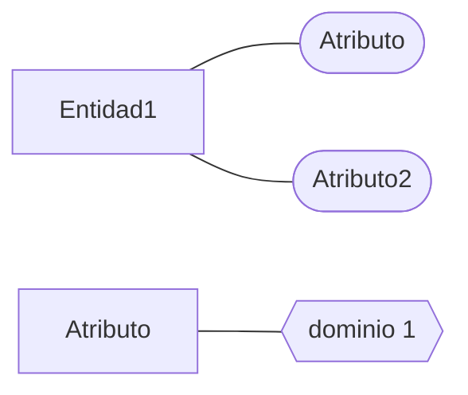

# Bases de Datos Relacionales

## Introducción
Este repositorio lo estaré complementando con todos los trabajos y tareas que realice durante lo largo de este curso. Es de mi interés poder seguir desarrollando mis habilidades para que eventualmente este repositorio pueda formar parte de mi currículum digital.

## Índice
[Tarea 1](https://github.com/Andreschavezp/BDR/blob/master/Tarea%201.md)

